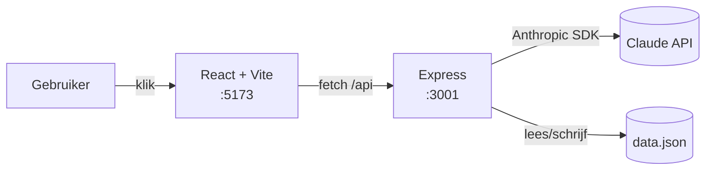
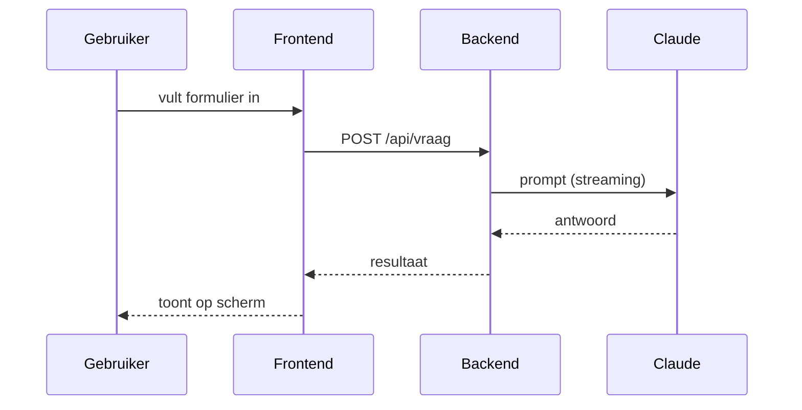

# AI Showcase — Nederlandse Overheid

Hackathon setup voor AI-showcases waarbij overheidsmedewerkers een wens meenemen en we die wens in korte tijd omzetten naar een werkende app.

## Context

- **Doel**: Snel werkende apps bouwen en live demonstreren op deze pc
- **Doelgroep**: Medewerkers van de Nederlandse overheid (niet per se technisch)
- **Tijdsdruk**: Elke sessie is 30–90 minuten
- **Aanpak**: Vraag eerst goed door wat de wens precies is, kies dan de eenvoudigste stack die werkt

## Folder structuur

```
hackaton/
  CLAUDE.md          ← dit bestand (algemene regels)
  .claude/           ← Claude Code settings + skills
  new-session.sh     ← maak een nieuwe sessie-folder aan
  _template/         ← template voor nieuwe sessies
  sessie-01-naam/    ← per showcase een eigen subfolder
  sessie-02-naam/
  ...
```

Elke sessie-subfolder heeft zijn eigen `CLAUDE.md` met de specifieke wens en context.

## Techstack — standaard keuzes

Gebruik altijd de **eenvoudigste stack** die de wens kan realiseren. Volgorde van voorkeur:

### Frontend (altijd)
- **Vite + React + TypeScript** — snelste dev-server, minste config
  ```bash
  npm create vite@latest app -- --template react-ts
  cd app && npm install && npm run dev
  ```
- Gebruik standaard **Tailwind CSS** voor styling. Het **NL Design System** (overheidshuisstijl) gebruik je **alleen als de medewerker dat expliciet wenst** — vraag dit bij de intake (zie sessie-CLAUDE.md, stap 3). Niet automatisch aanzetten, ook niet als het een overheids-app lijkt.
- State: `useState`/`useEffect` voor simpel, Zustand als het groeit

### Backend (alleen als nodig)
- **Express (Node.js + TypeScript)** — één taal voor frontend én backend, geen extra runtime nodig
  ```bash
  npm init -y && npm install express cors
  node server.js
  ```
- **Hono (Node.js)** — als je iets lichters/snellers wilt met ingebouwde TypeScript-types
  ```bash
  npm install hono @hono/node-server
  ```
- Voeg CORS altijd toe voor lokale dev
- Geen Python — houd de hele stack op Node/JavaScript zodat er maar één toolchain nodig is

### Database (als persistentie nodig is)
- **JSON-bestand** (`data.json`) — voor eenvoudige opslag, geen setup
- **SQLite via better-sqlite3** (Node) — als relaties nodig zijn
- Geen PostgreSQL/MySQL voor showcases — te veel setup

### AI-integratie
- **Anthropic SDK**: `npm install @anthropic-ai/sdk`
- Model: `claude-sonnet-4-6` (snel en capabel), `claude-opus-4-8` (als kwaliteit prioriteit is)
- API-key staat in omgevingsvariabele `ANTHROPIC_API_KEY`
- Gebruik streaming voor chat-achtige interfaces

### Poorten (lokale dev)
| Service | Poort |
|---------|-------|
| Vite frontend | 5173 |
| Express backend | 3001 |

## Werkwijze per app-type

### Simpele tool (formulier → resultaat)
→ Vite + React only, geen backend. Roep API direct vanuit de browser aan.

### Chat-interface
→ Vite + React frontend + Express backend (streaming). Bewaar conversatie in React state.

### Data-dashboard
→ Vite + React + JSON-bestand of CSV. Gebruik recharts of chart.js voor grafieken.

### CRUD-applicatie
→ Vite + React + Express + SQLite (better-sqlite3). Genereer REST-endpoints en gebruik fetch() in de frontend.

### Overheids-look (alleen op verzoek)
→ Installeer NL Design System: `npm install @nldd/design-system`. Gebruik de nldd skill (zie hieronder). **Doe dit alleen wanneer de medewerker bij de intake aangeeft de overheidshuisstijl te willen** — standaard blijft de keuze Tailwind.

## Skills en plugins

| Skill | Type | Gebruik |
|-------|------|---------|
| `nldd` | lokaal (`.claude/skills/nldd/`) | NL Design System web components, tokens, layout-patronen, toegankelijkheid |
| `developer-overheid` | plugin (GitHub) | Nederlandse overheidsstandaarden: API Design Rules, open source, NL Design System |

De `nldd` skill is lokaal gekopieerd uit `../ai/storybook/skills/nldd/` en bevat:
- `SKILL.md` — hoe je de componenten goed gebruikt, visie, patronen
- `reference.md` — alle `nldd-*` elementen met attributen, slots en events
- `design-guidelines.md` — ontwerpkeuzes (formulieren, navigatie, feedback, microcopy)
- `changelog.md` — releasehistorie voor veilig upgraden

Marketplace: `../ai/skills-marketplace/marketplace.json` — extra plugins via Claude Code plugin-systeem.

## Regels

- Scaffold met `scaffold-frontend.sh` / `scaffold-backend.sh`, start daarna alles tegelijk met `./dev.sh` (frontend + backend, beide hot reload)
- Frontend draait op `npm run dev` (Vite HMR, direct zichtbaar), backend op `node --watch server.js` (herstart bij wijziging)
- Gebruik snelle install-flags (`npm install --no-audit --no-fund --prefer-offline`) om scaffolden kort te houden
- **Open automatisch de browser zodra er iets te tonen is** — wacht niet tot de medewerker erom vraagt. Zodra de dev-server draait, een statische pagina, een HTML-bestand, een grafiek, een PDF of een ander zichtbaar resultaat klaar is, open het direct met `xdg-open <url-of-bestand>` (Linux). Voor een Vite-app: `xdg-open http://localhost:5173` zodra de server luistert. Open de browser maar één keer per resultaat; bij latere wijzigingen zorgt HMR voor live updates.
- **Genereer altijd architectuurdocumentatie met plaatjes** — maak per sessie een `ARCHITECTUUR.md` met diagrammen die de structuur van de app visueel maken (zie sectie hieronder). Open dit document direct in de browser zodra het klaar is.
- Zet `ANTHROPIC_API_KEY` altijd via omgevingsvariabele, nooit hardcoded
- Maak geen onnodige bestanden aan — houd de sessie-folder zo klein mogelijk
- Commit niet tenzij de medewerker dat expliciet wil
- Als iets te lang duurt (>5 minuten bouwen): gooi het weg en begin opnieuw met een eenvoudigere aanpak

## Architectuurdocumentatie (verplicht per sessie)

Maak voor elke app een `ARCHITECTUUR.md` in de sessie-folder waarin de structuur visueel duidelijk wordt. Doel: een niet-technische overheidsmedewerker ziet in één oogopslag hoe de app in elkaar zit. Genereer dit aan het eind, zodra de app werkt, en **open het meteen in de browser**.

### Wat erin moet
1. **Korte tekst** — wat doet de app, in 2–3 zinnen.
2. **Architectuurdiagram** — componenten (frontend, backend, AI, opslag) en hoe ze met elkaar praten.
3. **Datastroom / sequence** — wat gebeurt er stap voor stap als de gebruiker iets doet (klik → API → AI → resultaat).
4. **Mapstructuur** — een boom van de belangrijkste bestanden met één regel uitleg per stuk.

### Hoe — gebruik Mermaid (tekst → plaatje)
Schrijf de diagrammen als Mermaid-codeblokken in `ARCHITECTUUR.md`. Mermaid rendert direct in de browser, GitHub en VS Code — geen extra tooling nodig. Voorbeeld:

````markdown
## Architectuur



## Datastroom


````

### Plaatjes tonen / exporteren
- **Snelst (aanbevolen)**: open `ARCHITECTUUR.md` in de browser via een viewer die Mermaid rendert. Als er geen markdown-preview is, genereer een kleine standalone `architectuur.html` die de Mermaid-CDN (`https://cdn.jsdelivr.net/npm/mermaid/dist/mermaid.min.js`) inlaadt en open die met `xdg-open architectuur.html`.
- **Echte PNG/SVG nodig?** Gebruik de Mermaid CLI on-demand:
  ```bash
  npx -y @mermaid-js/mermaid-cli -i ARCHITECTUUR.md -o architectuur.png
  xdg-open architectuur.png
  ```
- Houd het simpel: 1–3 diagrammen per app is genoeg. Pas de diagrammen aan de werkelijk gebouwde stack aan (laat backend/AI/opslag weg als de app puur frontend is).

## Nieuwe sessie starten

```bash
./new-session.sh "naam-van-de-wens"
```

Dit maakt `sessie-XX-naam-van-de-wens/` aan met een CLAUDE.md template en start Claude Code erin.
