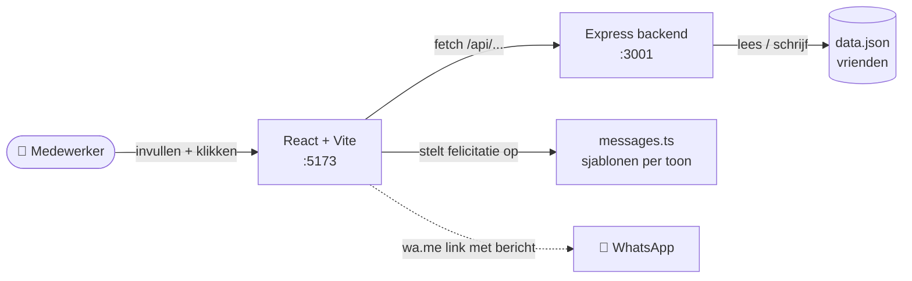
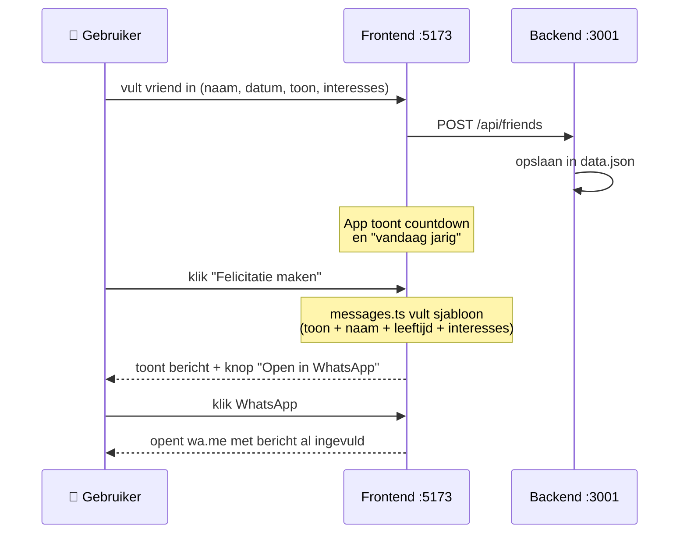
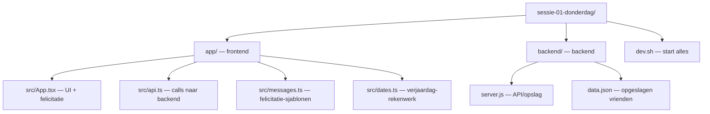

# Architectuur — Verjaardags-felicitator

De app houdt de verjaardagen van je vrienden bij, laat zien wie er (binnenkort)
jarig is, en stelt lokaal een persoonlijke felicitatie op die je met één klik in
WhatsApp opent. Er is geen AI en geen API-key nodig. De vrienden worden lokaal op
deze pc bewaard in een simpel JSON-bestand.

## Onderdelen en hoe ze samenwerken

## Datastroom — een felicitatie maken

## Mapstructuur

## Belangrijkste bestanden

| Bestand | Wat het doet |
|---------|--------------|
| `app/src/App.tsx` | Het scherm: formulier om vrienden toe te voegen, lijst met countdown, knop om de felicitatie te maken en in WhatsApp te openen |
| `app/src/messages.ts` | Stelt de felicitatie lokaal op uit sjablonen per toon — vult naam, leeftijd en interesses in (geen AI) |
| `app/src/api.ts` | Verbindt de frontend met de backend (vrienden ophalen/toevoegen/verwijderen) |
| `app/src/dates.ts` | Rekent uit wie er vandaag jarig is, hoeveel dagen tot de volgende verjaardag en welke leeftijd iemand wordt |
| `backend/server.js` | De server: bewaart vrienden in `data.json` |
| `backend/data.json` | De opgeslagen vrienden (wordt automatisch aangemaakt) |
