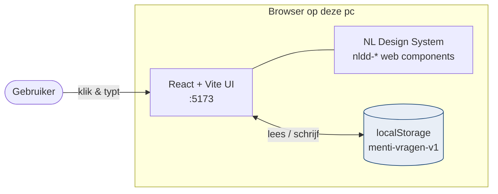
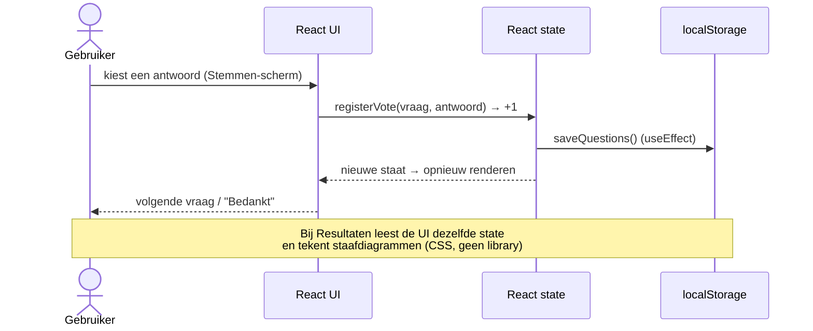
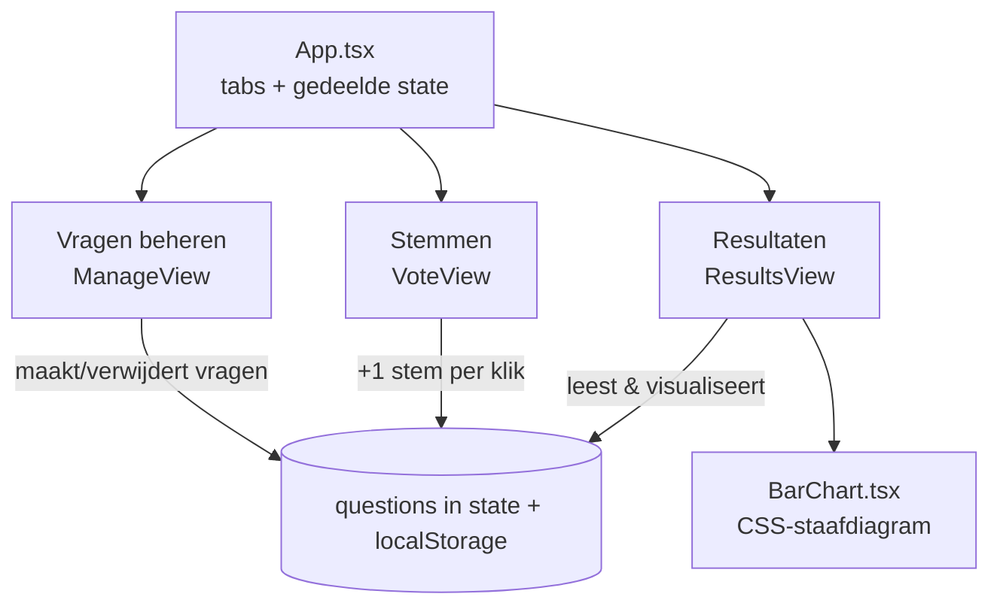

# Architectuur — Stemwijzer

Een lokale Mentimeter-achtige app in de Rijkshuisstijl. Je stelt vragen met
antwoordopties op, laat mensen op deze pc stemmen, en bekijkt de resultaten als
staafdiagrammen met aantallen en percentages. Alles draait volledig in de
browser; er is geen server en geen internetverbinding nodig.

## Componenten



De hele app is **frontend-only**. De NLDD web components leveren de
Rijkshuisstijl en toegankelijkheid; `localStorage` bewaart de vragen en stemmen
zodat ze na herladen behouden blijven.

## Datastroom — een stem uitbrengen



## De drie schermen



## Mapstructuur

```
sessie-01/
├── ARCHITECTUUR.md          ← dit document
├── README.md                ← wat het is + hoe te starten
└── app/                     ← de Vite + React applicatie
    ├── index.html
    └── src/
        ├── main.tsx         ← opstart: registreert NLDD-componenten, mount React
        ├── App.tsx          ← tabnavigatie + gedeelde state + opslaglogica
        ├── ManageView.tsx   ← vragen + antwoordopties aanmaken/verwijderen
        ├── VoteView.tsx     ← stemmen, één vraag tegelijk
        ├── ResultsView.tsx  ← resultaten + export (JSON) + reset
        ├── BarChart.tsx     ← horizontale staafdiagrammen in pure CSS
        ├── storage.ts       ← lezen/schrijven naar localStorage
        ├── types.ts         ← datamodel (Question, Answer)
        ├── nldd.d.ts        ← TypeScript: staat <nldd-*> toe in JSX
        └── index.css        ← layout + NLDD-tokens (Rijkshuisstijl)
```
