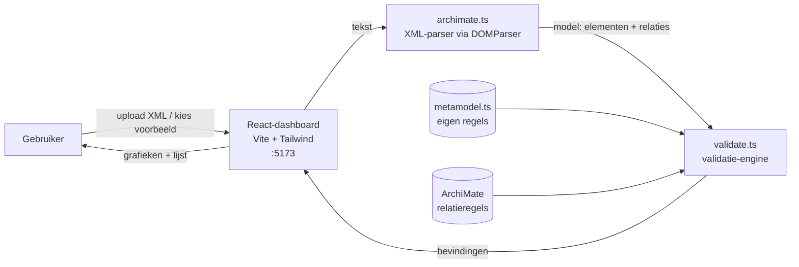
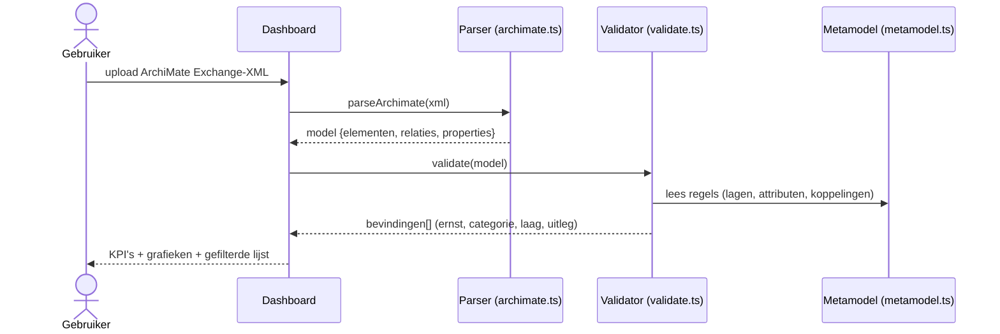
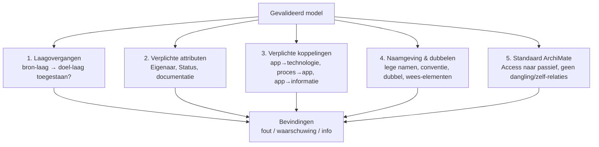

# Architectuur — Architectuur-validatietool

Een dashboard dat een **ArchiMate Exchange-XML** (architectuurrepository met business-,
informatie-, applicatie- en technologielaag) inleest en toetst aan een **metamodel**.
Het toont per laag de afwijkingen, met grafieken en een filterbare bevindingenlijst.
Alles draait lokaal in de browser — er gaat geen data naar een server.

## Architectuur



De vier bouwstenen:

| Onderdeel | Bestand | Rol |
|-----------|---------|-----|
| **Parser** | `src/archimate.ts` | Leest de Exchange-XML namespace-veilig in tot een `AmModel` (elementen, relaties, properties). |
| **Metamodel** | `src/metamodel.ts` | De eigen regels: laagindeling, toegestane laagovergangen, verplichte attributen, verplichte koppelingen, naamgeving. **Hier pas je de regels aan.** |
| **Validator** | `src/validate.ts` | Past het metamodel + standaard ArchiMate-regels toe en levert een lijst `Finding`s. |
| **Dashboard** | `src/App.tsx` | KPI's, grafieken (recharts) en de filterbare bevindingenlijst. |

## Datastroom — wat gebeurt er bij een validatie



## Welke checks draaien er



## Mapstructuur

```
sessie-03/
  ARCHITECTUUR.md          ← dit document
  README.md                ← wat het is en hoe je het start
  dev.sh                   ← start de frontend (HMR)
  app/
    index.html
    src/
      App.tsx              ← dashboard: KPI's, grafieken, filters, lijst
      MetamodelPanel.tsx   ← popup die de actieve regels toont
      archimate.ts         ← parser voor ArchiMate Exchange-XML
      metamodel.ts         ← HET METAMODEL: alle eigen regels (pas hier aan)
      validate.ts          ← validatie-engine (metamodel + ArchiMate-regels)
      sampleModel.ts       ← voorbeeld-XML met bewuste fouten
      types.ts             ← datamodel + labels/kleuren per laag
    public/
      voorbeeld-vergunningverlening.xml   ← downloadbaar voorbeeldbestand
```
