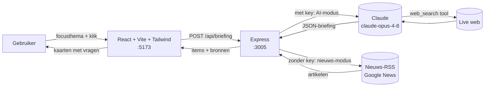
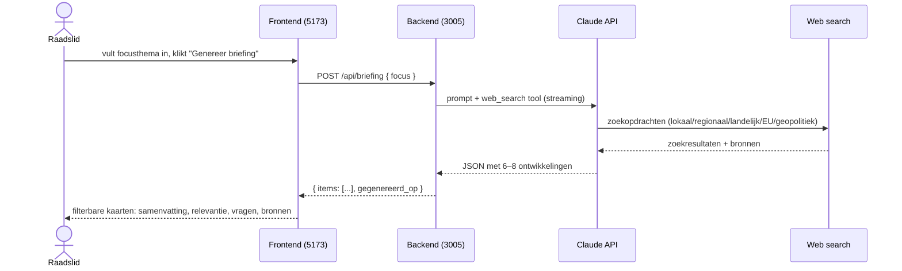
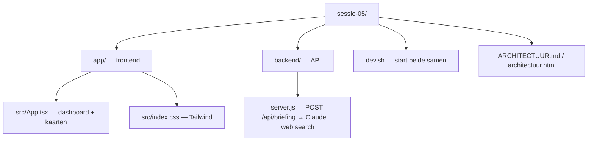

# Architectuur — Fractie-Radar Volt Soest

Een briefing-dashboard dat live op het web zoekt naar belangrijke ontwikkelingen
(lokaal, regionaal, landelijk, Europees, geopolitiek) en die voor een raadslid omzet in
samenvattingen plus concrete vragen voor het college. De frontend toont de
resultaten als filterbare kaarten; de backend laat Claude live web search doen.

## Architectuur

De backend kiest één van twee databronnen op basis van de aanwezigheid van een
`ANTHROPIC_API_KEY`.

## Datastroom

## Mapstructuur

- **app/src/App.tsx** — het dashboard: focus-invoer, categoriefilters en de briefing-kaarten.
- **app/src/index.css** — laadt Tailwind in.
- **backend/server.js** — Express-API; `POST /api/briefing` bouwt de prompt, roept Claude met de web-search-tool aan en geeft gestructureerde JSON terug.
- **dev.sh** — start frontend (Vite HMR, :5173) en backend (`node --watch`, :3005) tegelijk.
