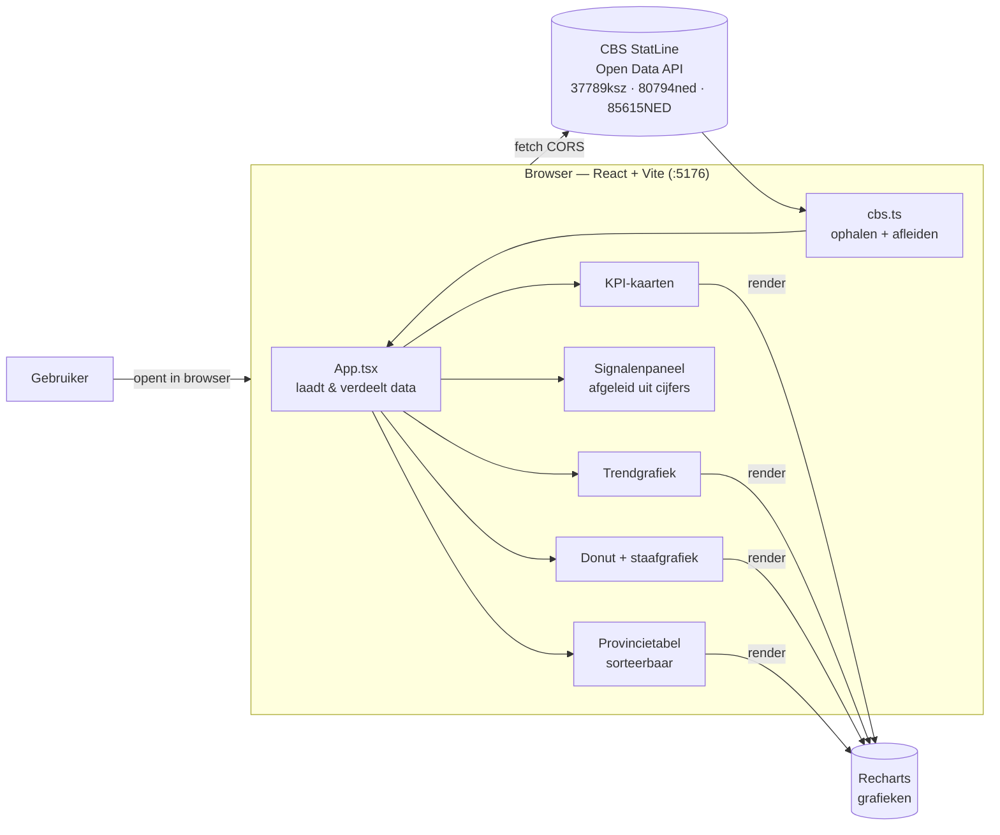
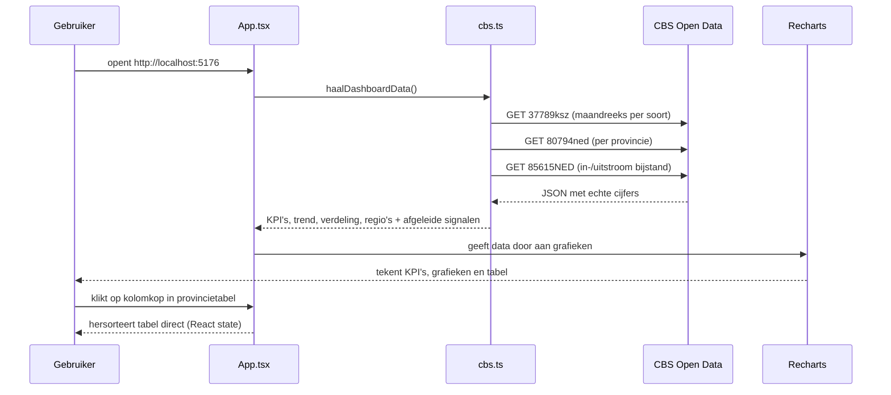

# Architectuur — Dashboard Inclusieve Arbeidsmarkt

Een **signaaldashboard** dat ontwikkelingen rond uitkeringen, arbeidsongeschiktheid en
regionale verschillen in één oogopslag zichtbaar maakt. Het is een puur front-end app
die **live, echte cijfers** ophaalt bij **CBS StatLine Open Data** — geen backend of
database nodig. Beleidsmakers en uitvoerders zien zo direct waar actie nodig of mogelijk is.

## Architectuur



Er is bewust **geen eigen backend, AI of database**: CBS levert de data via een
CORS-API die de browser rechtstreeks mag aanroepen. Dat houdt de stack zo eenvoudig
mogelijk én alle cijfers zijn echt en herleidbaar (zie `DEFINITIES.md`).

## Datastroom — wat gebeurt er als je het dashboard opent



## Mapstructuur

```
sessie-06/
├── README.md                 ← wat is dit & hoe start je het
├── ARCHITECTUUR.md           ← dit document
├── dev.sh                    ← start de dev-server (HMR)
└── app/
    ├── index.html            ← HTML-startpunt
    ├── tailwind.config.js    ← Tailwind + rijksblauw accentkleur
    └── src/
        ├── main.tsx          ← mount React in de pagina
        ├── App.tsx           ← laadt CBS-data, toont laad-/foutstatus + secties
        ├── index.css         ← Tailwind basis-styling
        ├── cbs.ts            ← haalt CBS op, transformeert, leidt signalen af
        └── components/
            ├── KpiCard.tsx        ← kerncijfer met maand-op-maand trendpijl
            ├── TrendChart.tsx     ← bestand per soort per maand (lijngrafiek)
            ├── FlowChart.tsx      ← in-/uitstroom bijstand per kwartaal (+ saldo)
            ├── SignalenPanel.tsx  ← signalen (afgeleid uit de cijfers)
            ├── Donut.tsx          ← verdeling uitkeringssoorten
            ├── StaafVerdeling.tsx ← arbeidsongeschiktheid naar regeling
            └── RegioTabel.tsx     ← sorteerbare tabel per provincie
```

## Techkeuzes in het kort

| Onderdeel | Keuze | Waarom |
|-----------|-------|--------|
| Frontend | Vite + React + TypeScript | Snelste dev-server, type-veilig |
| Styling | Tailwind CSS | Snel, flexibel (geen overheidshuisstijl gewenst) |
| Grafieken | Recharts | Eenvoudige, mooie React-grafieken |
| Data | CBS StatLine Open Data (live) | Echte, openbare cijfers via CORS — geen backend/DB nodig |

Zie **`DEFINITIES.md`** voor de betekenis en exacte CBS-bron van elk getal.
